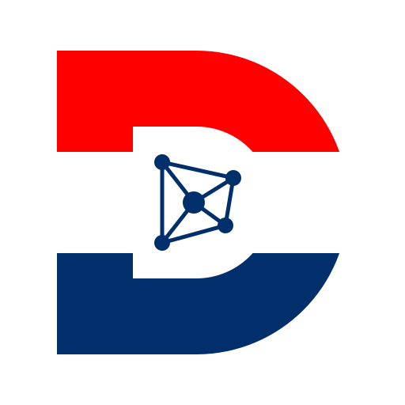
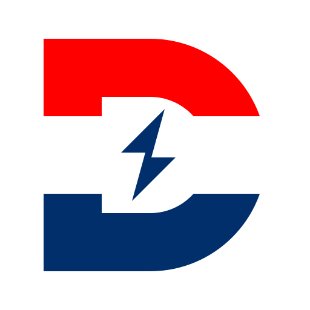
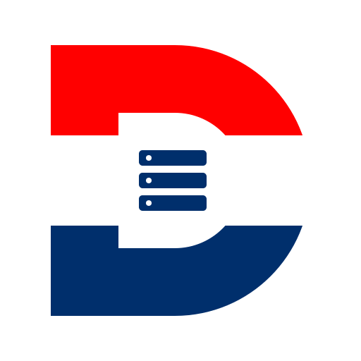
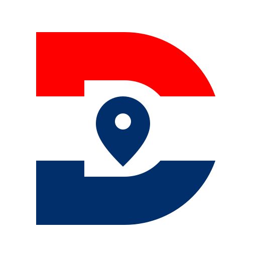
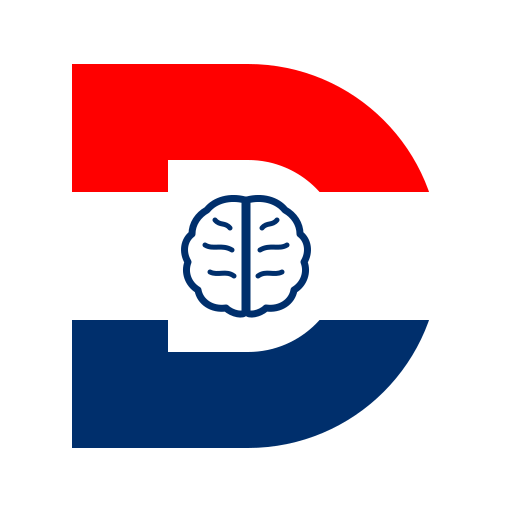
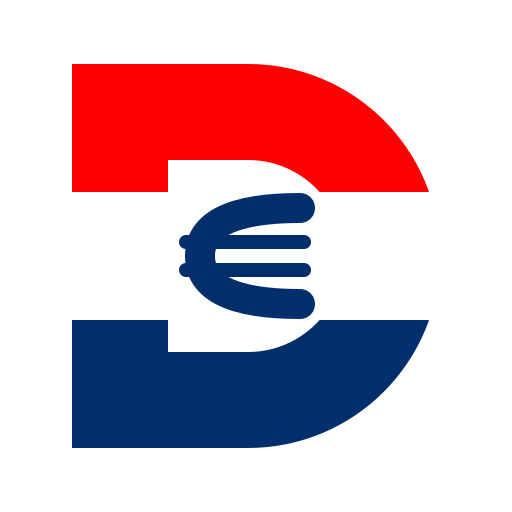
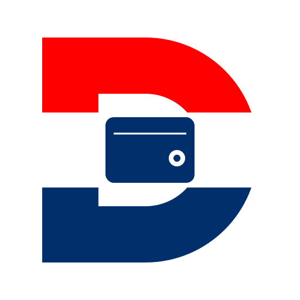

# Mediakit — Domovina

Službeni brand resursi obitelji proizvoda **Domovina**.

<p align="center">
  
  &nbsp;&nbsp;
  
  &nbsp;&nbsp;
  
  &nbsp;&nbsp;
  
  &nbsp;&nbsp;
  
  &nbsp;&nbsp;
  
  &nbsp;&nbsp;
  
  &nbsp;&nbsp;
  
  &nbsp;&nbsp;
  
</p>

## O repozitoriju

Repozitorij sadrži službene logotipe — u vektorskom (SVG) i rasterskom (PNG) formatu — za sve proizvode obitelji **Domovina**. Namijenjen je novinarima, partnerima, autorima sadržaja te svima koji žele referencirati ili prikazati Domovina brendove u izvornom, neizmijenjenom obliku.

## Brand sustav

Svi logotipi dijele jedinstveni vizualni okvir koji osigurava prepoznatljivost obitelji proizvoda:

- **Slovo „D"** ispunjeno horizontalnim prugama hrvatske zastave (crvena, bijela, plava) — vizualni temelj koji povezuje brend s hrvatskim identitetom.
- **Unutarnje bijelo „D"** — negativan prostor koji okružuje simbol proizvoda i osigurava čitljivost.
- **Središnji simbol** u tamnoplavoj boji (`#002F6C`) — jedinstven je za svaki proizvod i nosi semantičku poruku o njegovoj namjeni.
- **Bijela pozadina sa zaobljenim kutovima** — radijus zaobljenja iznosi 32 jedinice na platnu od 512 × 512.

### Paleta boja

| Naziv | HEX | Uloga |
|---|---|---|
| Crvena (HR zastava) | `#FF0000` | Gornja traka slova „D" |
| Bijela | `#FFFFFF` | Srednja traka i pozadina |
| Tamnoplava (HR zastava) | `#002F6C` | Donja traka i središnji simbol |

## Proizvodi

### Domovina TV


Video platforma s domaćim sadržajem. Središnji simbol — trokut s vrhom udesno (play gumb) — univerzalno prepoznatljiv znak za reprodukciju multimedije.

<br clear="left">

### Domovina AI


Platforma za AI-asistirane usluge nad medijskim sadržajem. Središnji simbol — povezani čvorovi oko zajedničkog središta — predstavlja neuronsku mrežu i graf znanja koji povezuje sadržaj, izvore i kontekst.

<br clear="left">

### Domovina Energy


Platforma za skupno financiranje (*crowdfunding*) obnovljivih izvora energije u Hrvatskoj — fotonaponskih elektrana, infrastrukture za električna vozila te vozila na vodik. Središnji simbol — munja — predstavlja električnu energiju kao zajednički nazivnik svih budućih energetskih vertikala.

<br clear="left">

### Domovina Klubovi


Otvoreni javni katalog svih hrvatskih nogometnih klubova — od SuperSport HNL-a do 3. ŽNL — s kontaktima, ligama, stadionima i geo-koordinatama. Središnji simbol — nogometna lopta (kružnica s peterokutom u središtu i pet zrakastih šavova) — neposredno označava domenu proizvoda. Geometrijski peterokut unutar lopte je univerzalni element nogometne lopte i ne treba ga miješati s peterokrakom zvijezdom.

<br clear="left">

### Domovina Cloud


Self-hosted platforma za deployment cijelog Domovina ekosistema (`app.domovina.link`). Pokreće sve domovina.* poddomene s vlastite infrastrukture — bez ovisnosti o vanjskim PaaS dobavljačima. Središnji simbol — tri složena pravokutnika s indikatorima statusa — predstavlja slojeve aplikacijskih kontejnera (Docker) i aktivne servise koji čine osnovu platforme. Vizualno evocira ikonografiju server rack-a, što je univerzalan znak za samostalno hostiranu infrastrukturu.

<br clear="left">

### Domovina Karta


Interaktivna krovna GIS karta Hrvatske (`gis.domovina.ai`) — 556 jedinica lokalne samouprave, 6.759 naselja, 901 nogometni klub, zračne luke i prilazni koridori, sve nad otvorenim podacima. Središnji simbol — kartografska oznaka pozicije (*map pin*) s kružnim središtem — univerzalno je prepoznatljiv znak za lokaciju na karti i neposredno označava domenu proizvoda: geografiju i prostorne podatke.

<br clear="left">

### Domovina Provjera


Obitelj offline web alata za samoprocjenu mentalnog zdravlja u odraslih, izgrađena oko validiranih kliničkih screenera. Prvi modul je **ADHD.provjera** prema upitniku ASRS v1.1 (Svjetska zdravstvena organizacija i Harvard Medical School), dostupan na `stepanic.github.io/adhd-provjera`. Sva obrada odgovora odvija se isključivo u pregledniku korisnika — nijedan podatak ne napušta uređaj. Središnji simbol — stilizirani mozak iz prednjeg pogleda, s dvije hemisfere, *corpus callosumom* i tankim vijugama — neposredno označava domenu proizvoda: neurokognitivnu i mentalno-zdravstvenu samoprocjenu.

<br clear="left">

### Domovina Pay


Generator platnih barkodova za hrvatska plaćanja i most prema *on-chain* euru (`pay.domovina.ai`). Iz jedne forme producira SEPA EPC QR (Revolut, Wise, sve EPC-kompatibilne aplikacije), HUB3 PDF417 (FINA, mobilno bankarstvo hrvatskih banaka) i EIP-681 wallet QR za Monerium EURe odnosno Gnosis Chain. Središnji simbol — znak eura (`€`) — neposredno označava domenu proizvoda: eurom denominirane prijenose, neovisno o tome odvijaju li se SEPA tračnicama ili javnom blockchain mrežom.

<br clear="left">

### Domovina Wallet


Self-custody EURe novčanik na Gnosis Chain mreži (`wallet.domovina.ai`), s passkey potpisom umjesto seed fraze. PWA aplikacija koja korisniku daje vlastiti Safe (ERC-1271) novčanik vezan uz uređaj — bez posrednika, bez čuvanja ključeva na poslužitelju. Središnji simbol — stilizirani novčanik (*billfold*) s utorom za karticu i drukerom (*snap clasp*) — univerzalno prepoznatljiv znak za osobni novčanik koji neposredno označava domenu proizvoda: pohranu i prijenos vrijednosti pod vlastitom kontrolom.

<br clear="left">

## Datoteke

| Proizvod | Vektor (SVG) | Raster (PNG, 2048 × 2048) |
|---|---|---|
| Domovina TV | [`domovina_tv_logo_square.svg`](domovina_tv_logo_square.svg) | [`domovina_tv_logo_square.png`](domovina_tv_logo_square.png) |
| Domovina AI | [`domovina_ai_logo_square.svg`](domovina_ai_logo_square.svg) | [`domovina_ai_logo_square.png`](domovina_ai_logo_square.png) |
| Domovina Energy | [`domovina_energy_logo_square.svg`](domovina_energy_logo_square.svg) | [`domovina_energy_logo_square.png`](domovina_energy_logo_square.png) |
| Domovina Klubovi | [`domovina_klubovi_logo_square.svg`](domovina_klubovi_logo_square.svg) | [`domovina_klubovi_logo_square.png`](domovina_klubovi_logo_square.png) |
| Domovina Cloud | [`domovina_cloud_logo_square.svg`](domovina_cloud_logo_square.svg) | [`domovina_cloud_logo_square.png`](domovina_cloud_logo_square.png) |
| Domovina Karta | [`domovina_karta_logo_square.svg`](domovina_karta_logo_square.svg) | [`domovina_karta_logo_square.png`](domovina_karta_logo_square.png) |
| Domovina Provjera | [`domovina_provjera_logo_square.svg`](domovina_provjera_logo_square.svg) | [`domovina_provjera_logo_square.png`](domovina_provjera_logo_square.png) |
| Domovina Pay | [`domovina_pay_logo_square.svg`](domovina_pay_logo_square.svg) | [`domovina_pay_logo_square.png`](domovina_pay_logo_square.png) |
| Domovina Wallet | [`domovina_wallet_logo_square.svg`](domovina_wallet_logo_square.svg) | [`domovina_wallet_logo_square.png`](domovina_wallet_logo_square.png) |

**Preporuka:** za sve digitalne i tiskane primjene koristite SVG kad god je to moguće — vektor ostaje oštar pri bilo kojoj veličini. PNG koristite isključivo ondje gdje SVG nije podržan (primjerice u nekim alatima za društvene mreže ili pri pripremi sažetaka u e-mailovima).

## Generiranje PNG-ova iz SVG-a

Sve PNG datoteke u repozitoriju generirane su iz pripadajućih SVG izvora pomoću alata [`rsvg-convert`](https://wiki.gnome.org/Projects/LibRsvg) (dio paketa `librsvg`):

```bash
# instalacija (macOS)
brew install librsvg

# generiranje svih logotipa na 2048 × 2048
for name in tv ai energy klubovi cloud karta provjera pay wallet; do
  rsvg-convert -w 2048 -h 2048 \
    "domovina_${name}_logo_square.svg" \
    -o "domovina_${name}_logo_square.png"
done
```

Za drugačiju veličinu jednostavno zamijenite vrijednost parametra `-w` i `-h` (npr. `512`, `1024`, `4096`).

## Pravila korištenja

Brand resursi smiju se koristiti uz sljedeća pravila:

- **Bez izmjena.** Logotip se ne smije mijenjati — zabranjene su izmjene boja, proporcija, rotacija, dodavanje efekata, teksta ili drugih elemenata.
- **Bez izvedenih verzija** koje bi mogle izazvati zabunu s izvornim brendom ili sugerirati partnerstvo, sponzorstvo ili odobrenje koje ne postoji.
- **Sigurnosni prostor.** Oko logotipa ostavite slobodan prostor jednak najmanje 1/8 njegove ukupne visine.
- **Minimalna veličina.** Na zaslonu logotip ne koristite manji od 24 × 24 piksela jer središnji simbol ispod te veličine postaje nečitljiv.
- **Pozadina.** Logotip ima ugrađenu bijelu pozadinu sa zaobljenim kutovima. Ne postavljajte ga preko teksturiranih površina ni preko boja koje smanjuju kontrast s rubom.

## Licenca

Sadržaj ovog repozitorija (logotipi, izvorne datoteke, dokumentacija i pripadajući materijali) licenciran je pod **[Creative Commons Attribution-NoDerivatives 4.0 International (CC BY-ND 4.0)](https://creativecommons.org/licenses/by-nd/4.0/deed.hr)**.

Slobodno smijete:

- **Dijeliti** — kopirati i redistribuirati materijal u bilo kojem mediju ili formatu, uključujući komercijalnu upotrebu

Pod sljedećim uvjetima:

- **Atribucija** — morate navesti odgovarajuće priznanje autoru, poveznicu na licencu i naznačiti jesu li napravljene izmjene
- **Bez prerada** — ako preradite, transformirate ili nadograđujete materijal, ne smijete distribuirati izmijenjeni materijal

Puni pravni tekst dostupan je u datoteci [`LICENSE`](LICENSE) te na [creativecommons.org/licenses/by-nd/4.0/legalcode](https://creativecommons.org/licenses/by-nd/4.0/legalcode).

## O brendu i nazivima

**Domovina** je trenutno osobni projekt u ranoj fazi razvoja. Iza naziva **„Domovina"**, **„Domovina TV"**, **„Domovina AI"**, **„Domovina Energy"**, **„Domovina Klubovi"**, **„Domovina Cloud"**, **„Domovina Karta"**, **„Domovina Provjera"**, **„Domovina Pay"** i **„Domovina Wallet"** zasad **ne stoji registrirana pravna osoba ni registrirani žig** — riječ je o radnim nazivima koje autor koristi za identifikaciju projekta.

CC BY-ND 4.0 licenca odnosi se na **autorska prava na grafičkom djelu**. Ne treba je tumačiti kao dopuštenje za preuzimanje naziva ili logotipa kao identiteta nekog drugog proizvoda, usluge, tvrtke ili inicijative.

Ako razvijate nešto u srodnom prostoru i razmišljate o korištenju ili referenciranju ovih naziva ili materijala, **slobodno se javite prije** — autor je otvoren za razgovor o suradnji, atribuciji ili preklapanju opsega.

Bez prethodnog kontakta dobrodošla je sljedeća upotreba:

- Uredničko, novinarsko, akademsko ili tehničko referenciranje projekta (npr. spominjanje u članku, studiji, blog objavi ili dokumentaciji), uz uvjet da je referenca poštena i ne implicira odnos koji ne postoji
- Dijeljenje ili ugradnja neizmijenjenih logotipa radi identifikacije projekta

Autor zadržava sva prava koja po važećem pravu mogu nastati iz autorstva grafičkog djela i prvenstva upotrebe naziva, uključujući pravo na buduću formalnu registraciju žiga.

## Kontakt

Za pitanja o korištenju brand resursa, mogućim preklapanjima naziva, suradnji ili partnerstvima obratite se autoru projekta **Domovina**.
